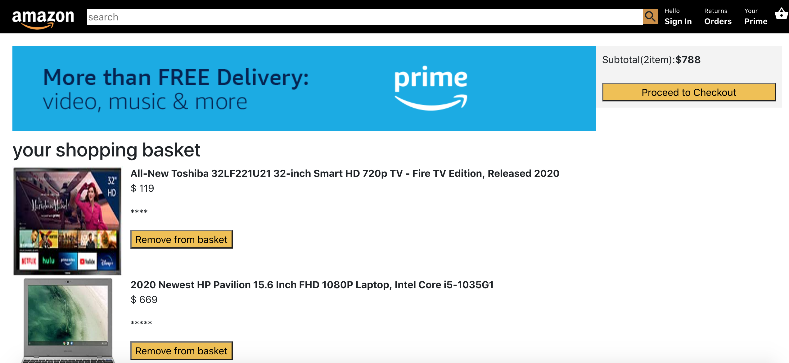

 Full stack Web Application Amazon clone using React on Forntend using Redux for State Managment and Firebase for Authetication and database

Technology used:

HTML5 and CSS3: Semantic Elements, CSS Grid, Flexbox
React: Components, Props, Events, Hooks, Router, Axios
Redux: Store, Reducers, Actions
Firebase Authetication and database

Check it Live below:
https://clone-3a4f7.firebaseapp.com/

